# 👋 Hi, I'm Bryan Gan

🎓 **Student @ Drexel University**  
Currently pursuing a degree in Software Engineering, with a passion for building meaningful tech solutions and automating the ordinary.

## 🛠️ Skills
- **Languages:** Python, Java, HTML, TypeScript
- **Interests:** Automation, software design, building cool side projects

## 🚀 Featured Projects
- [GearMatch](https://github.com/bryanygan/gearmatch): A quiz-based web application recommends peripherals
- [Crazy 8s](https://github.com/bryanygan/crazy8s): A fun and interactive card game project
- [zreatsbot](https://github.com/bryanygan/zreatsbot): A bot focused on Discord automation

## 🏀 Outside of Code
When I’m not coding, you’ll find me on the basketball court, exploring the latest in video games, or tinkering with new ways to automate everyday tasks. I also love collecting vinyl and buying cool clothes!

## 🌐 Connect with Me
- [LinkedIn](https://www.linkedin.com/in/bryanygan/)
- [Personal Website](https://bryangan.com/)

  
  

<!--
**bryanygan/bryanygan** is a ✨ special ✨ repository because its README.md (this file) appears on your GitHub profile.
-->
